# AI-Driven Design Intelligence for Early Stage CAD Validation
## Production System Architecture — v1.0

---

## 1. Executive Summary

This document defines the production architecture for **DesignGuard AI** — an AI-powered CAD validation platform that performs real-time design analysis and automated compliance checking inside the engineer's native CAD environment. The system extracts live 3D geometry data from CAD tools (SolidWorks, CATIA, NX, Fusion 360), runs it through a multi-model inference pipeline combining geometric deep learning with rule-based expert systems, and surfaces actionable violations directly on the 3D model with severity-coded visual overlays. A structured knowledge graph of design standards (ISO, ASME, DIN, custom) powers the validation logic, enabling non-ML engineers to author and version rules without retraining models. The architecture is designed for <2 second in-CAD feedback latency, handles sensitive IP through a hybrid on-premise/cloud deployment model, and scales horizontally to support enterprise design teams of 500+ concurrent users.

---

## 2. High-Level Architecture

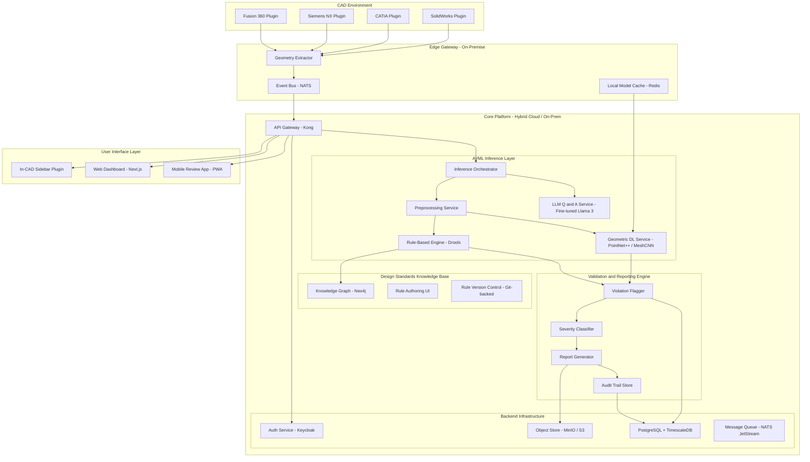

### Deployment Topology

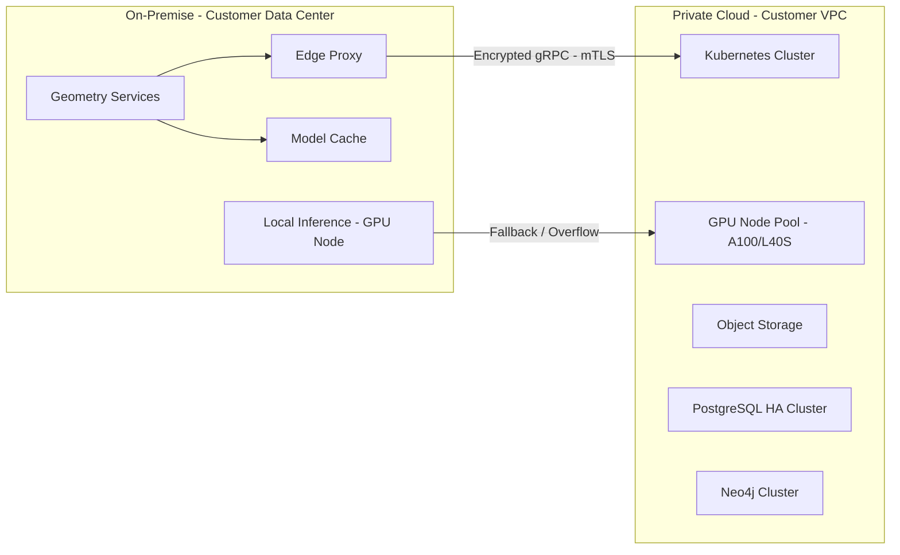

---

## 3. Module-by-Module Breakdown

---

### 3.1 CAD Integration Layer

#### Purpose
Extract real-time geometry, feature trees, and assembly metadata from the engineer's active CAD session and relay it to the inference pipeline with minimal latency.

#### Architecture

| Component | Technology | Justification |
|-----------|-----------|---------------|
| **SolidWorks Plugin** | C# (.NET), SolidWorks API (COM Interop) | Native COM-based API is the only supported integration path; C# provides robust interop |
| **CATIA Plugin** | C++ (CAA V5/V6 RADE) | CATIA's Automation API requires CAA C++ for deep feature tree access; no viable alternative |
| **Siemens NX Plugin** | C++/C# (NX Open API) | NX Open supports both; C++ preferred for performance-critical geometry extraction |
| **Fusion 360 Plugin** | JavaScript/TypeScript (Fusion API) | Fusion uses Electron-based runtime; JS/TS is the native plugin language |
| **Geometry Extractor Core** | Rust (shared library via FFI) | Cross-platform, memory-safe, high-performance geometry normalization; called by each plugin via C ABI |
| **Event Transport** | NATS (lightweight pub/sub) | Sub-millisecond latency, embeddable, supports on-premise without infrastructure overhead |

#### Geometry Extraction Strategy

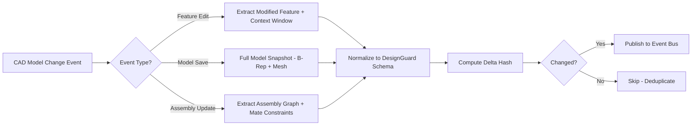

#### Key Design Decisions

1. **Delta-based extraction over full-model polling.** Each plugin hooks into the CAD tool's event system (e.g., `swDmDocumentEvents` for SolidWorks, `NXOpen.Session.UndoMarkCreated` for NX). Only changed geometry is extracted and transmitted, reducing bandwidth by ~85% compared to periodic full-model snapshots.

2. **Canonical Intermediate Representation (CIR).** All CAD-specific geometry is normalized into a platform-agnostic schema before leaving the integration layer:

```json
{
  "schema_version": "1.4.0",
  "source_cad": "solidworks",
  "extraction_timestamp": "2026-03-30T04:55:00Z",
  "model_id": "uuid-v7",
  "delta_type": "feature_edit",
  "geometry": {
    "brep": {
      "faces": [],
      "edges": [],
      "vertices": [],
      "topology": { "shells": [], "lumps": [] }
    },
    "mesh": {
      "vertices": "base64_encoded_float32_array",
      "faces": "base64_encoded_uint32_array",
      "normals": "base64_encoded_float32_array",
      "resolution": "medium"
    },
    "feature_tree": {
      "features": [
        {
          "id": "feat-001",
          "type": "extrude",
          "parameters": { "depth": 25.0, "direction": [0, 0, 1] },
          "parent": null,
          "children": ["feat-002"]
        }
      ]
    }
  },
  "metadata": {
    "material": "AISI 304 Stainless Steel",
    "units": "mm",
    "tolerance_class": "ISO 2768-mK",
    "assembly_context": {
      "parent_assembly": "housing_assy_v3",
      "mate_constraints": []
    }
  }
}
```

3. **Rust-based normalization core.** A shared `.dll`/`.so` library handles tessellation quality control, coordinate system normalization, and schema validation. Each CAD plugin calls this via FFI, ensuring consistent behavior across platforms while keeping the hot path in compiled, optimized code.

4. **Embedded NATS for event transport.** Rather than requiring engineers to set up RabbitMQ or Kafka, the plugin embeds a NATS client that connects to a lightweight on-premise NATS server (or directly to the edge gateway). This keeps the installation footprint minimal.

#### APIs Exposed

| Endpoint | Protocol | Purpose |
|----------|----------|---------|
| `geometry.extract.delta` | NATS subject | Incremental geometry change event |
| `geometry.extract.snapshot` | gRPC | Full model snapshot on demand |
| `plugin.health` | HTTP GET | Plugin health/version for monitoring |
| `plugin.config` | HTTP GET/PUT | Runtime configuration (extraction resolution, event throttle) |

---

### 3.2 AI/ML Inference Layer

#### Purpose
Process extracted geometry through multiple specialized models to detect violations, assess design quality, and answer natural language queries — all within the 2-second latency budget.

#### Inference Pipeline Architecture

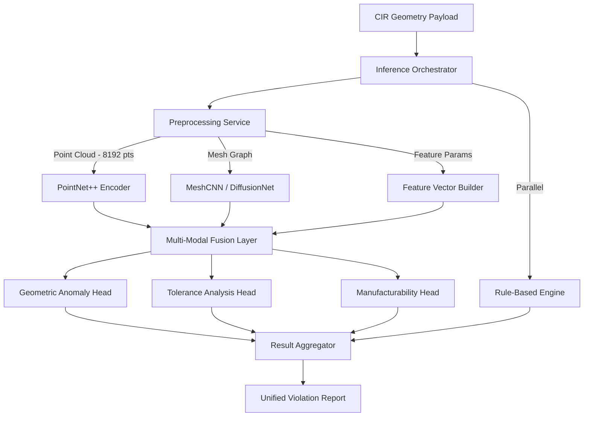

#### Model Selection and Justification

| Model | Task | Architecture | Justification |
|-------|------|-------------|---------------|
| **PointNet++ (Modified)** | Global shape analysis, missing feature detection | Set Abstraction + Multi-Scale Grouping | Processes raw point clouds directly; invariant to point ordering; hierarchical feature learning captures local and global geometry. Modified with attention layers for manufacturing feature recognition. |
| **DiffusionNet** | Surface-level analysis (wall thickness, draft angles) | Diffusion-based learning on meshes | Superior to MeshCNN for surface property prediction; robust to mesh quality variations common in live CAD extraction; O(n) complexity with spectral acceleration. |
| **XGBoost Ensemble** | Tolerance stack-up analysis | Gradient-boosted trees | Tabular feature vectors from tolerance chains; interprets well; fast inference (<5ms); outperforms NNs on structured/tabular tolerance data in benchmarks. |
| **Rule-Based Engine (Drools)** | Deterministic standard compliance | Forward-chaining production rules | Design standards have precise numeric thresholds (e.g., "minimum wall thickness for ABS = 1.5mm"); ML approximation is inappropriate where exact thresholds exist. Rules execute in <1ms. |
| **Fine-tuned Llama 3 (8B)** | NL Q&A, design intent explanation | Causal LLM with LoRA adapters | On-premise deployable; 8B parameter model fits single GPU; LoRA enables company-specific fine-tuning without full retraining; quantized (GPTQ 4-bit) for fast inference. |

#### Latency Budget Breakdown

```
Total Budget: 2000ms
├── Network (plugin → edge → core):   80ms
├── Preprocessing & Normalization:    120ms
├── Parallel Inference:
│   ├── PointNet++ (GPU):             350ms
│   ├── DiffusionNet (GPU):           400ms  ← Critical path
│   ├── XGBoost (CPU):                 5ms
│   └── Rule Engine (CPU):            15ms
├── Result Aggregation:                50ms
├── Severity Classification:           30ms
├── Response Serialization:            25ms
└── Network (core → plugin):          80ms
                              ─────────────
                              Total: ~1155ms (845ms headroom)
```

> [!IMPORTANT]
> The parallel execution of PointNet++ and DiffusionNet is critical. Sequential execution would blow the 2-second budget. The orchestrator dispatches both simultaneously and awaits both futures.

#### Preprocessing Pipeline

1. **Point Cloud Sampling:** Farthest Point Sampling (FPS) to 8,192 points from B-Rep tessellation. Preserves sharp edges and small features better than random sampling.
2. **Mesh Preparation:** Remesh to uniform triangle size (target 10K faces for surfaces under analysis). Compute Laplacian eigenvectors for DiffusionNet input.
3. **Feature Vector Construction:** Extract 47 engineered features from the feature tree (pocket depth ratios, fillet radius distributions, draft angle histograms, wall thickness maps via ray casting).
4. **Context Window:** For incremental updates, include the modified feature plus its 2-hop neighborhood in the feature tree to preserve geometric context.

#### Model Serving Infrastructure

| Component | Technology | Configuration |
|-----------|-----------|---------------|
| **Model Server** | NVIDIA Triton Inference Server | Dynamic batching (max_batch_size=8, max_queue_delay=50ms) |
| **GPU Hardware** | NVIDIA A100 40GB (cloud) / L40S (on-prem) | 2 GPUs per node; models partitioned across GPUs |
| **Model Format** | ONNX (PointNet++, DiffusionNet), XGBoost native | ONNX enables hardware-agnostic optimization via TensorRT |
| **Caching** | Redis with geometry-hash keys | Cache inference results; ~40% hit rate for iterative design sessions |
| **Scaling** | Kubernetes HPA on GPU utilization | Scale 2 to 8 GPU pods based on queue depth |

#### Fine-Tuning Pipeline

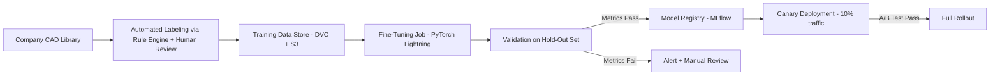

- **Training Data Strategy:** Semi-supervised. The rule engine auto-labels ~70% of violations from existing CAD libraries. Senior engineers review and label the remaining edge cases via a labeling UI. Target: 50K labeled models for initial training, 5K per quarter for continuous improvement.
- **Feedback Loop:** Every engineer override of an AI decision (dismiss, accept, modify severity) is captured and fed back as a training signal. Quarterly retraining incorporates this feedback.

---

### 3.3 Design Standards Knowledge Base

#### Purpose
Serve as the single source of truth for all design rules — industry standards, company-specific guidelines, and project-level overrides. Must be queryable at inference time (<5ms) and authorable by non-ML engineers.

#### Architecture

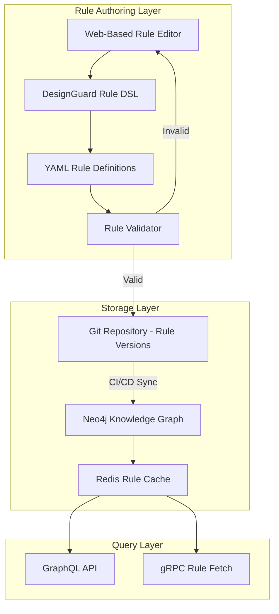

#### Knowledge Graph Schema

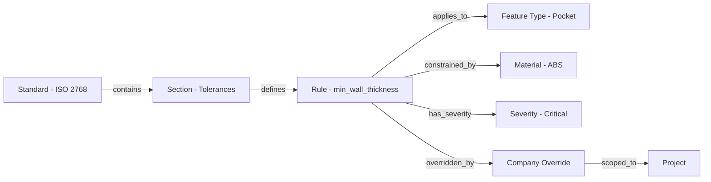

#### Rule Definition DSL

Engineers author rules in a human-readable DSL that compiles to the graph representation:

```yaml
# rule: minimum_wall_thickness_injection_molding
standard: "Company-STD-2024-IM"
parent_standard: "ISO 294-3"
version: "2.1.0"
effective_date: "2026-01-15"
author: "j.smith@company.com"

applies_to:
  feature_types: [wall, rib, boss]
  manufacturing_process: injection_molding
  material_classes: [thermoplastic]

condition:
  metric: wall_thickness_min
  operator: ">="
  threshold:
    default: 1.5  # mm
    material_overrides:
      ABS: 1.2
      Polycarbonate: 1.0
      Nylon_PA6: 0.8

severity: critical
message: "Wall thickness {actual_value}mm below minimum {threshold}mm for {material}"

suggested_fix:
  action: increase_wall_thickness
  target_value: "{threshold + 0.3}"
  explanation: |
    Thin walls in injection molding cause short shots, sink marks,
    and warping. Add 0.3mm margin above minimum for process reliability.

references:
  - standard: "ISO 294-3"
    clause: "6.2.1"
    url: "https://internal-docs/iso-294-3#6.2.1"
```

#### Key Design Decisions

1. **Neo4j over relational DB.** Design rules have deeply nested relationships (standard → section → rule → feature type → material → process). Graph traversal queries (e.g., "find all rules that apply to an extruded pocket in ABS for injection molding under ISO 294-3 with company overrides") execute in O(depth) on a graph vs. O(n x joins) in SQL.

2. **Git-backed version control.** Every rule change is a Git commit. This provides full audit trail, diff capability, branch-based rule development (e.g., "draft-2026-Q2-rules"), and rollback. CI/CD pipeline syncs approved rules to Neo4j.

3. **Rule priority and override cascade:**
   ```
   Project-Specific Override > Company Standard > Industry Standard (latest) > Industry Standard (legacy)
   ```
   Each rule node carries a priority score; the query layer resolves conflicts deterministically.

4. **Hot-reload without downtime.** Redis acts as a materialized cache of the active rule set. On rule publish, a NATS event triggers cache invalidation and reload. Inference services never query Neo4j directly — they read from Redis, ensuring <1ms rule lookup.

---

### 3.4 Validation and Reporting Engine

#### Purpose
Aggregate inference results and rule checks into a unified violation report, classify severity, suggest fixes, highlight issues on the 3D model, and generate exportable reports with audit trail.

#### Architecture

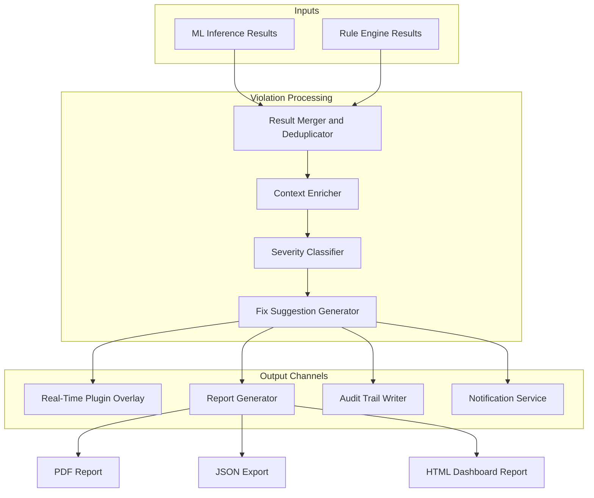

#### Violation Data Schema

```json
{
  "violation_id": "viol-2026-03-30-00142",
  "model_id": "mdl-uuid-v7",
  "timestamp": "2026-03-30T04:50:12Z",
  "source": "ml_inference | rule_engine | hybrid",
  "detection": {
    "type": "wall_thickness_violation",
    "category": "manufacturability",
    "confidence": 0.94,
    "severity": "critical",
    "severity_score": 9.2
  },
  "location": {
    "feature_id": "feat-017",
    "feature_type": "wall",
    "face_ids": ["face-042", "face-043"],
    "bounding_box": { "min": [12.5, 0.0, 3.2], "max": [14.1, 8.0, 3.9] },
    "centroid": [13.3, 4.0, 3.55]
  },
  "details": {
    "measured_value": 0.8,
    "required_value": 1.2,
    "unit": "mm",
    "material": "ABS",
    "applicable_rule": "rule:minimum_wall_thickness_injection_molding:v2.1.0",
    "applicable_standard": "Company-STD-2024-IM derived from ISO 294-3 clause 6.2.1"
  },
  "explanation": {
    "summary": "Wall thickness of 0.8mm is below the 1.2mm minimum for ABS injection molding",
    "technical_detail": "Detected via ray-casting analysis confirmed by DiffusionNet surface prediction at 94% confidence. This wall section between faces 042-043 will likely cause short shots and sink marks during molding.",
    "evidence": ["diffusionnet_heatmap_base64", "ray_cast_cross_section_svg"]
  },
  "suggested_fix": {
    "action": "Increase wall thickness to 1.5mm with 1.2mm minimum plus 0.3mm process margin",
    "auto_fixable": false,
    "fix_complexity": "low",
    "estimated_impact": "No significant mass or cost increase, approximately 2g additional material"
  },
  "audit": {
    "detection_pipeline_version": "3.2.1",
    "model_versions": {
      "diffusionnet": "v2.4.0-ft-companyX",
      "rule_engine": "v2.1.0"
    },
    "reviewed_by": null,
    "review_status": "pending"
  }
}
```

#### Severity Classification Framework

| Level | Score Range | Criteria | Action Required |
|-------|-----------|----------|-----------------|
| **Critical** | 8.0–10.0 | Structural failure risk, manufacturing impossibility, safety standard violation | Blocks design release; mandatory fix |
| **Warning** | 4.0–7.9 | Performance degradation, tight tolerances, material waste, non-preferred practices | Review recommended; fix before production |
| **Info** | 0.0–3.9 | Best practice suggestions, optimization opportunities, style guide deviations | Optional improvement; logged for reference |

Severity scoring formula:
```
severity_score = w1 * safety_impact + w2 * manufacturing_risk + w3 * standard_criticality + w4 * ml_confidence
```
Where weights `w1..w4` are configurable per company and stored in the knowledge base.

#### Report Generation

| Format | Engine | Use Case |
|--------|--------|----------|
| **PDF** | Puppeteer (headless Chrome rendering of HTML template) | Formal design review documents, regulatory submissions |
| **JSON** | Native serialization | API consumption, downstream system integration (PLM, ERP) |
| **HTML** | Next.js SSR with embedded 3D viewer (Three.js) | Interactive web review with clickable violations on 3D model |

Reports include:
- Executive summary with pass/fail status
- Violation breakdown by category and severity (charts)
- Per-violation detail cards with 3D location screenshots
- Rule traceability (which standard, which clause)
- Comparison to previous revision (diff view)
- Digital signatures for approval workflow

---

### 3.5 User Interface Layer

#### Purpose
Surface AI insights where engineers already work — inside CAD — and provide a complementary web dashboard for review, analytics, and management.

#### In-CAD Plugin Sidebar

```
+---------------------------------------------------+
|  DesignGuard AI                         Settings   |
+---------------------------------------------------+
|  Model: Housing_Assembly_v3.sldasm                 |
|  Status: Analyzing... (1.2s)                       |
+---------------------------------------------------+
|  +--- Validation Summary -----------------------+  |
|  |  CRITICAL:  2    WARNING:  5                  |  |
|  |  INFO:      8    PASSED:  142                 |  |
|  +----------------------------------------------+  |
+---------------------------------------------------+
|  CRIT-001: Wall Thickness Violation                |
|  -- Feature: Wall-017 (0.8mm < 1.2mm min)         |
|  -- Standard: ISO 294-3 / Company-IM-2024          |
|  -- [Zoom to Feature]  [Details]                   |
|  -- Fix: Increase to 1.5mm                         |
|                                                    |
|  CRIT-002: Draft Angle Missing                     |
|  -- Feature: Pocket-003 (0deg detected, 1deg req)  |
|  -- Standard: DIN 16742                            |
|  -- [Zoom to Feature]  [Details]                   |
|  -- Fix: Add 1.5deg draft to faces 12-15           |
|                                                    |
|  WARN-001: Tight Tolerance Stack-Up                |
|  -- Assembly: Shaft-Bearing interface              |
|  -- Cumulative: +/-0.12mm (limit: +/-0.15mm)      |
|  -- Review: Consider datum optimization            |
+---------------------------------------------------+
|  Ask DesignGuard AI:                               |
|  +---------------------------------------------+  |
|  | "Why is draft angle required here?"          |  |
|  +---------------------------------------------+  |
|                                                    |
|  AI: Draft angles are required on feature          |
|  Pocket-003 because the part is tagged for         |
|  injection molding (Company-IM-2024, section 4.3). |
|  The 1deg minimum ensures clean part ejection      |
|  from the mold. DIN 16742 Table 3 specifies...     |
+---------------------------------------------------+
|  [Report]  |  [History]  |  [Settings]             |
+---------------------------------------------------+
```

#### Technology Choices per Platform

| CAD Platform | UI Framework | Integration Method |
|-------------|-------------|-------------------|
| SolidWorks | WPF (C#) | Task Pane via `ITaskpaneView` API |
| CATIA | Qt (C++) | CAA Workshop with custom workbench |
| Siemens NX | WinForms / WPF (C#) | Block Styler UI via NX Open |
| Fusion 360 | HTML/CSS/JS | Fusion palette (embedded Chromium) |

#### Web Dashboard (Standalone)

| Component | Technology | Purpose |
|-----------|-----------|---------|
| **Frontend** | Next.js 14 (App Router) + TypeScript | Server-side rendering, API routes, dynamic dashboards |
| **3D Viewer** | Three.js + custom violation overlay renderer | Interactive 3D model viewing with clickable violation markers |
| **Charts** | Recharts / D3.js | Trend analysis, violation heatmaps, team metrics |
| **State Management** | Zustand | Lightweight, predictable client state |
| **Design System** | Radix UI + custom theme | Accessible, consistent component library |
| **Auth** | NextAuth.js to Keycloak OIDC | SSO integration with enterprise identity providers |

#### Role-Based Access

| Role | In-CAD Plugin | Web Dashboard | Capabilities |
|------|--------------|---------------|-------------|
| **Design Engineer** | Full access | Own models and team view | Run validation, view/dismiss violations, query AI |
| **Lead Engineer / Reviewer** | Read-only overlay | Full team view + approval | Review violations, approve/reject designs, override severity |
| **Engineering Manager** | — | Analytics and reports | View team metrics, compliance trends, cost-of-rework dashboard |
| **Standards Engineer** | — | Rule authoring + test | Create/edit rules, run rule simulations, manage standard mappings |
| **IT Admin** | — | Admin panel | User management, system config, audit logs |

---

### 3.6 Backend and Infrastructure

#### Architecture Pattern: Modular Monolith evolving to Microservices

> [!TIP]
> We choose a **modular monolith** for Phase 1 (MVP) that evolves into microservices for Phase 2. This avoids premature distributed systems complexity while maintaining clear module boundaries that enable later decomposition.

**Justification:**
- MVP team size (5–8 engineers) does not justify microservice operational overhead
- All modules share the same deployment cadence initially
- Module boundaries are enforced via internal package interfaces (Go interfaces / Rust traits)
- Phase 2 extracts high-scale modules (inference, reporting) into independent services when traffic patterns diverge

#### Technology Stack

| Component | Technology | Justification |
|-----------|-----------|---------------|
| **API Gateway** | Kong (OSS) | Plugin ecosystem (rate limiting, auth, logging), gRPC and REST support, Kubernetes-native |
| **Core Services** | Go 1.22+ | Strong concurrency (goroutines for parallel inference dispatch), fast compilation, small binary footprint for on-prem deployment |
| **Inference Orchestrator** | Python 3.12 (FastAPI) | PyTorch/ONNX ecosystem is Python-native; FastAPI provides async inference dispatch |
| **Database** | PostgreSQL 16 + TimescaleDB | Relational data + time-series metrics (validation history, latency tracking) in one engine |
| **Knowledge Graph** | Neo4j 5.x (Community to Enterprise) | Graph queries for rule resolution; Cypher is expressive for traversal |
| **Object Storage** | MinIO (on-prem) / S3 (cloud) | CAD model storage; MinIO provides S3-compatible API for air-gapped deployments |
| **Message Queue** | NATS JetStream | Persistent messaging with at-least-once delivery; embeddable; replaces Kafka with 10x less operational burden |
| **Cache** | Redis 7 (Cluster) | Inference result caching, rule cache, session state |
| **Auth/IAM** | Keycloak 24 | OIDC/SAML SSO, RBAC, enterprise IdP federation (LDAP, Active Directory) |
| **Container Orchestration** | Kubernetes (k3s for on-prem, EKS/GKE for cloud) | GPU scheduling, HPA, rolling deployments |
| **CI/CD** | GitLab CI + ArgoCD | GitOps deployment; ArgoCD for Kubernetes manifest sync |
| **Observability** | OpenTelemetry to Grafana (Loki + Tempo + Mimir) | Distributed tracing (critical for latency debugging), log aggregation, metrics |
| **Model Registry** | MLflow | Model versioning, artifact tracking, deployment metadata |

#### Data Security Architecture

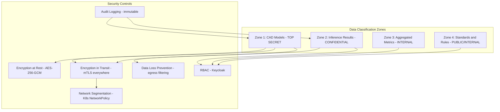

**Key security decisions:**

1. **CAD geometry never leaves the customer network.** In the on-premise deployment model, all geometry extraction and inference run on local GPU nodes. Only aggregated metrics (violation counts, latency percentiles) are optionally sent to a cloud analytics endpoint.

2. **Zero-trust networking.** All inter-service communication uses mTLS via a service mesh (Linkerd, chosen over Istio for lower resource footprint). No implicit trust between services.

3. **Ephemeral geometry processing.** Raw geometry payloads are processed in-memory and purged after inference. Only the violation report (which contains coordinates but not full model data) is persisted. Configurable retention policy (default: 90 days).

#### CI/CD Pipeline

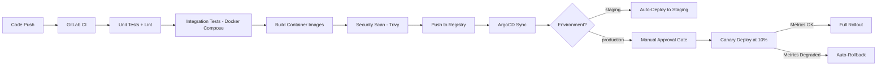

**Model CI/CD (separate pipeline):**
- Model training runs in isolated GPU environments
- MLflow tracks experiments, hyperparameters, and metrics
- Trained models go through validation gate (accuracy, latency, fairness checks)
- Approved models are registered in MLflow and deployed via Triton model repository
- A/B testing with shadow mode (new model runs in parallel, results compared before promotion)

---

## 4. Technology Stack Summary

| Layer | Component | Technology | Justification |
|-------|-----------|-----------|---------------|
| **CAD Integration** | SolidWorks Plugin | C# / .NET 8 | Native COM interop required |
| | CATIA Plugin | C++ / CAA RADE | Only supported deep integration path |
| | NX Plugin | C# / NX Open | Managed code support, easier maintenance |
| | Fusion 360 Plugin | TypeScript / Fusion API | Native JS runtime in Fusion |
| | Geometry Normalizer | Rust (FFI library) | Performance + safety for hot path |
| | Event Transport | NATS | Sub-ms latency, embeddable |
| **AI/ML Inference** | Shape Analysis | PointNet++ (PyTorch) | Point cloud native, hierarchical features |
| | Surface Analysis | DiffusionNet (PyTorch) | Mesh-robust, O(n) spectral method |
| | Tolerance Analysis | XGBoost | Best for tabular tolerance data |
| | Rule Execution | Drools 8 | Production-grade rule engine, deterministic |
| | NL Q and A | Llama 3 8B (GPTQ) | On-prem deployable, LoRA fine-tunable |
| | Model Serving | NVIDIA Triton | Dynamic batching, multi-model, GPU optimized |
| **Knowledge Base** | Knowledge Graph | Neo4j 5.x | Graph traversal for rule resolution |
| | Rule Definitions | YAML DSL + Git | Human-readable, version-controlled |
| | Rule Cache | Redis 7 | Sub-ms rule lookups at inference time |
| **Validation** | Violation Processing | Go service | Low-latency aggregation |
| | Report Generation | Puppeteer + Three.js | Rich PDF/HTML with 3D views |
| | Audit Trail | PostgreSQL (append-only) | Immutable compliance records |
| **UI** | In-CAD (SolidWorks) | WPF / C# | Native Task Pane integration |
| | In-CAD (Fusion 360) | HTML/CSS/JS | Fusion palette via Chromium |
| | Web Dashboard | Next.js 14 + TypeScript | SSR, API routes, modern React |
| | 3D Viewer | Three.js | Browser-native 3D rendering |
| | Auth | Keycloak + NextAuth.js | Enterprise SSO via OIDC/SAML |
| **Backend** | API Gateway | Kong OSS | gRPC + REST, plugin ecosystem |
| | Core Services | Go 1.22 | Concurrency, small binaries |
| | Inference Service | Python / FastAPI | PyTorch ecosystem compatibility |
| | Database | PostgreSQL 16 + TimescaleDB | Relational + time-series |
| | Object Storage | MinIO / S3 | S3-compatible, on-prem capable |
| | Message Queue | NATS JetStream | Lightweight persistent messaging |
| | Container Orchestration | Kubernetes (k3s / EKS) | GPU scheduling, auto-scaling |
| | CI/CD | GitLab CI + ArgoCD | GitOps deployment model |
| | Observability | OpenTelemetry + Grafana stack | Distributed tracing, metrics, logs |

---

## 5. Data Flow Walkthrough

### Scenario: Engineer edits a wall thickness in SolidWorks

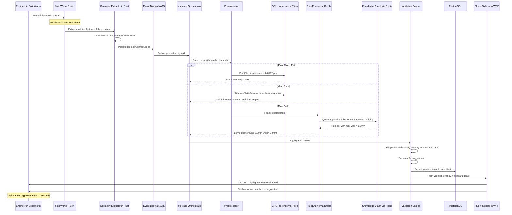

### Step-by-Step Narrative

| Step | Time | Action |
|------|------|--------|
| T+0ms | **Trigger** | Engineer changes wall thickness from 2.0mm to 0.8mm in SolidWorks feature manager |
| T+5ms | **Event capture** | Plugin's event hook catches `FeatureEditNotify` event |
| T+15ms | **Geometry extraction** | Rust extractor pulls modified wall feature + adjacent faces (2-hop in feature tree) |
| T+35ms | **Normalization** | CIR schema generated; delta hash computed; compared to last known state |
| T+40ms | **Event publish** | Geometry payload (~120KB) published to NATS `geometry.extract.delta` subject |
| T+120ms | **Preprocessing** | Orchestrator receives payload; preprocessor runs FPS, mesh prep, feature vector extraction in parallel |
| T+240ms | **Inference dispatch** | Three parallel inference tracks launched: PointNet++ (GPU), DiffusionNet (GPU), Rule Engine (CPU) |
| T+640ms | **Inference complete** | All three tracks return. DiffusionNet detects 0.8mm thickness (94% confidence). Rule engine confirms violation against company standard. |
| T+690ms | **Aggregation** | Validation engine merges ML + rule results, deduplicates, assigns severity score 9.2 (CRITICAL) |
| T+720ms | **Fix generation** | Fix suggestion generated: "Increase to 1.5mm" with cost/weight impact estimate |
| T+750ms | **Persistence** | Violation record written to PostgreSQL with full audit metadata |
| T+800ms | **UI update** | Violation overlay pushed to plugin sidebar; faces 42-43 highlighted red on 3D model |
| T+850ms | **Engineer sees feedback** | Red highlight appears on the thin wall with severity badge; sidebar shows actionable details |

**Total latency: ~850ms** (well within 2-second budget)

---

## 6. Key AI/ML Design Decisions

### 6.1 Multi-Model vs. Single End-to-End Model

**Decision: Multi-model pipeline with specialized heads.**

**Rationale:** A single end-to-end model that takes raw geometry and outputs all violation types would require enormous training data and would be a black box for regulatory compliance. Instead:
- **PointNet++** handles global shape understanding (missing features, topological anomalies)
- **DiffusionNet** handles surface-level analysis (thickness, draft, curvature)
- **XGBoost** handles structured tolerance chains (tabular data, not geometry)
- **Rule engine** handles exact threshold checks (no ML approximation where precision matters)

This separation enables:
- Independent model updates without retraining the whole pipeline
- Clear explainability (engineer can see which model flagged which issue)
- Hybrid confidence: ML predictions are validated against deterministic rules, reducing false positives

### 6.2 Rule Engine + ML Hybrid Strategy

**Decision: Rules are the primary authority; ML is the detection accelerator.**

The system operates in two modes:
1. **Rule-covered checks:** If a deterministic rule exists (e.g., "min wall thickness = 1.2mm"), the rule engine is authoritative. ML confirms or provides the measurement, but the threshold is the rule.
2. **ML-only checks:** For patterns without explicit rules (e.g., "this geometry will be difficult to tool"), ML provides the detection with a confidence score. These are flagged as "AI Suggestion" with lower default severity until an engineer validates.

This ensures engineers trust the system: they know standards-based checks are exact, and AI-based suggestions are clearly marked as recommendations.

### 6.3 Training Data Strategy

| Data Source | Volume Target | Label Method |
|-------------|--------------|-------------|
| Company CAD library (historical) | 50K models | Auto-labeled by rule engine + human review |
| Public CAD datasets (GrabCAD, Thingiverse) | 20K models | Pre-trained model weights (transfer learning) |
| Synthetic data (procedurally generated with violations) | 30K models | Parametric generation with known ground truth |
| Engineer feedback (production) | 5K samples/quarter | Implicit labels from accept/dismiss actions |

### 6.4 Explainability Framework

Every AI decision includes:
1. **Evidence heatmap:** Visual overlay on the 3D model showing which regions drove the prediction
2. **Feature attribution:** Top 5 geometric features that influenced the score (SHAP values for XGBoost, attention weights for PointNet++)
3. **Rule linkage:** If a related design standard exists, it is cited with clause numbers
4. **Confidence band:** Not just a score, but a confidence interval (e.g., "wall thickness estimated 0.8mm +/- 0.05mm with 94% confidence")

### 6.5 Feedback Loop Design

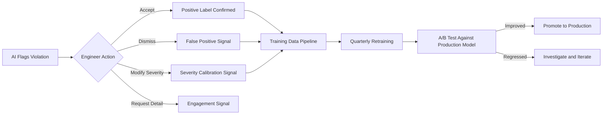

---

## 7. Risk Register

| # | Risk | Probability | Impact | Mitigation |
|---|------|------------|--------|-----------|
| **R1** | **CAD API instability across versions.** Major CAD vendors release API-breaking changes with new versions (e.g., SolidWorks 2026 deprecated COM events). | High | Critical | Abstract CAD interactions behind a stable adapter interface. Maintain per-version plugin branches. Allocate 20% of plugin engineering time to version compatibility testing. Join vendor partner programs for early API access. |
| **R2** | **ML false positives erode engineer trust.** If more than 5% of flagged violations are false positives, engineers will ignore the system (alert fatigue). | Medium | Critical | Start with high-precision rules-first approach. ML predictions require more than 90% confidence to show as Critical. Implement a 2-week shadow mode where AI suggestions are logged but not displayed, allowing precision tuning before go-live. Feedback loop reduces FP rate over time. |
| **R3** | **GPU infrastructure cost for on-premise.** Enterprise customers may not have GPU hardware, and procurement cycles are 3–6 months. | Medium | High | Support CPU-only inference mode using ONNX Runtime with quantized models (INT8). Latency degrades to ~4 seconds (acceptable for on-save validation, not real-time). Offer cloud inference as an option for GPU-constrained customers with data encryption. |
| **R4** | **Proprietary CAD data exfiltration.** A security breach exposing customer CAD models would be catastrophic for trust and liability. | Low | Critical | Geometry is processed in-memory and never written to persistent storage in raw form. mTLS on all channels. SOC 2 Type II certification by Phase 2. Annual penetration testing. Data residency controls (customer chooses region). Air-gapped deployment option. |
| **R5** | **Rule authoring complexity.** Non-ML engineers may struggle with the rule DSL, leading to incorrect rules that cause false violations. | Medium | Medium | Rule validator performs static analysis (type checking, unit validation, conflict detection). Sandbox environment where rules can be tested against sample models before deployment. Automated regression testing: new rules are tested against a suite of 1000 known-good models to detect unintended violations. |

---

## 8. Roadmap

### Phase 1: MVP (Months 1–6)

**Goal:** Prove value with a single CAD platform and core validation capabilities.

| Milestone | Deliverable | Month |
|-----------|------------|-------|
| M1.1 | SolidWorks plugin with geometry extraction (B-Rep + mesh) | Month 2 |
| M1.2 | Rule engine with 50 core rules (wall thickness, draft angle, fillet radius, hole diameter) | Month 3 |
| M1.3 | PointNet++ model trained on 20K models for missing feature detection | Month 4 |
| M1.4 | In-CAD sidebar with real-time violation display | Month 4 |
| M1.5 | PDF report generation | Month 5 |
| M1.6 | Basic web dashboard (view reports, manage rules) | Month 6 |

**Team:** 2 CAD engineers, 2 ML engineers, 2 backend engineers, 1 frontend engineer, 1 DevOps

**Exit Criteria:** 10 pilot users; less than 3 second latency; more than 85% precision on rule-based checks; user satisfaction at 7/10 or higher

---

### Phase 2: Enterprise Features (Months 7–14)

**Goal:** Multi-CAD support, enterprise security, and team collaboration.

| Milestone | Deliverable | Month |
|-----------|------------|-------|
| M2.1 | CATIA and Siemens NX plugins | Month 9 |
| M2.2 | DiffusionNet for surface analysis (thickness, draft, curvature) | Month 9 |
| M2.3 | Knowledge graph with full ISO/ASME/DIN coverage (500+ rules) | Month 10 |
| M2.4 | Tolerance stack-up analysis (XGBoost) | Month 10 |
| M2.5 | Keycloak SSO integration + RBAC | Month 11 |
| M2.6 | Approval workflow (design review cycle in dashboard) | Month 12 |
| M2.7 | SOC 2 Type II certification process started | Month 12 |
| M2.8 | On-premise deployment (k3s + air-gapped) | Month 13 |
| M2.9 | API for PLM/ERP integration (Teamcenter, Windchill) | Month 14 |

**Team expansion:** +2 CAD engineers, +1 ML engineer, +1 security engineer

**Exit Criteria:** 3 CAD platforms supported; 50+ enterprise pilot users; less than 2 second latency; more than 90% precision; SOC 2 audit initiated

---

### Phase 3: Advanced AI (Months 15–24)

**Goal:** Generative design suggestions, cross-project learning, and autonomous validation pipelines.

| Milestone | Deliverable | Month |
|-----------|------------|-------|
| M3.1 | LLM-powered natural language Q and A (Llama 3 fine-tuned) | Month 16 |
| M3.2 | Fusion 360 plugin | Month 17 |
| M3.3 | Generative fix suggestions (AI proposes geometry modifications, not just text) | Month 19 |
| M3.4 | Cross-project learning (anonymized violation patterns shared across teams) | Month 20 |
| M3.5 | Automated regression testing (new model revision auto-validated against previous) | Month 21 |
| M3.6 | Advanced analytics (cost-of-non-compliance, rework prediction) | Month 22 |
| M3.7 | Autonomous validation pipeline (CI/CD trigger validates CAD on commit to PDM) | Month 24 |

**Team expansion:** +2 ML engineers (generative AI), +1 product designer

**Exit Criteria:** All 4 CAD platforms; 200+ active users; LLM Q and A accuracy above 80%; measurable rework reduction (target: 30% fewer late-stage design changes)

---

## 9. Open Questions

> [!IMPORTANT]
> ### Q1: On-Premise vs. Hybrid Cloud Deployment Model
> Several enterprise customers will mandate that **no CAD geometry leaves their network**. This constrains us to on-premise GPU inference, which is expensive and limits scalability.
>
> **Decision needed:** Should we design for:
> - **(a)** On-premise first (higher infrastructure cost, simpler security story)
> - **(b)** Cloud-first with on-premise option (faster time to market, but on-prem is second-class)
> - **(c)** Hybrid where geometry stays on-prem but inference can optionally run in customer's VPC
>
> **Recommendation:** Option (c). Ship geometry extraction and preprocessing on-prem. Offer cloud inference in a customer-dedicated VPC with encrypted channels. Provide CPU-only on-prem fallback for GPU-constrained sites.

> [!IMPORTANT]
> ### Q2: Build vs. Buy for the Rule Engine
> We specified Drools (JBoss) as the rule engine. Alternatives:
> - **(a)** Drools — mature, Java-based, large community, but JVM adds memory overhead
> - **(b)** Open Policy Agent (OPA) / Rego — lighter weight, cloud-native, but less expressive for numeric/geometric rules
> - **(c)** Custom rule engine in Go/Rust — full control, no JVM dependency, but 3–4 months to build
>
> **Decision needed:** Stakeholder preference on JVM dependency vs. build cost.
>
> **Recommendation:** Option (a) for MVP (Drools is proven and fast to implement). Evaluate migration to (c) in Phase 2 if JVM overhead becomes a deployment friction point for on-prem customers with limited resources.

> [!WARNING]
> ### Q3: CAD Vendor Partnerships and API Access
> Deep integration with SolidWorks, CATIA, and NX requires:
> - Partner program membership with Dassault Systemes (SolidWorks, CATIA) and Siemens (NX)
> - Access to pre-release APIs for version compatibility
> - Potential co-marketing agreements for distribution
>
> **Decision needed:** Has the business development team initiated these partnerships? API access for CATIA (CAA RADE) in particular requires a commercial license agreement with Dassault. This is on the critical path for Phase 2.
>
> **Risk if unresolved:** Phase 2 CATIA and NX milestones slip by 2–3 months.

---

## Appendix A: Glossary

| Term | Definition |
|------|-----------|
| **B-Rep** | Boundary Representation — a CAD model representation using faces, edges, and vertices |
| **CIR** | Canonical Intermediate Representation — the platform-agnostic geometry schema used internally |
| **DiffusionNet** | A neural network that operates on triangle meshes using learned diffusion processes |
| **Drools** | A Java-based, open-source business rule management system |
| **FPS** | Farthest Point Sampling — a method to evenly subsample point clouds |
| **LoRA** | Low-Rank Adaptation — a parameter-efficient fine-tuning method for large language models |
| **mTLS** | Mutual TLS — both client and server authenticate each other via certificates |
| **PointNet++** | A deep learning architecture for processing unordered point sets with hierarchical features |
| **SHAP** | SHapley Additive exPlanations — a method for explaining individual predictions |

## Appendix B: Infrastructure Sizing (Phase 1 MVP)

| Resource | Specification | Quantity | Purpose |
|----------|-------------|----------|---------|
| GPU Node | NVIDIA L40S 48GB, 32 vCPU, 128GB RAM | 2 | Triton inference (PointNet++ + DiffusionNet) |
| App Node | 16 vCPU, 64GB RAM | 3 | Core services, rule engine, validation |
| DB Node | 8 vCPU, 32GB RAM, 500GB NVMe | 2 (primary + replica) | PostgreSQL + TimescaleDB |
| Graph DB | 8 vCPU, 32GB RAM, 200GB SSD | 1 | Neo4j knowledge graph |
| Cache | 4 vCPU, 16GB RAM | 2 (Redis cluster) | Inference + rule cache |
| Storage | — | 2TB | MinIO object storage for models + reports |

**Estimated monthly infrastructure cost (on-prem amortized):** $8,000–12,000
**Estimated monthly infrastructure cost (cloud, AWS):** $15,000–22,000

---

*Document version: 1.0 | Author: DesignGuard Architecture Team | Date: 2026-03-30*
*Next review: Upon stakeholder feedback on Open Questions (Q1–Q3)*
